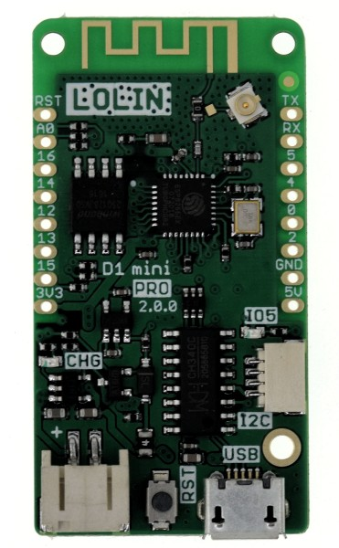
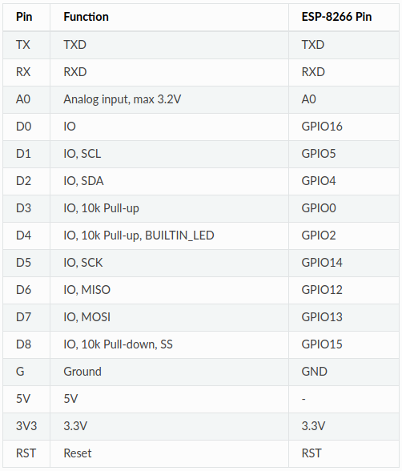

 # WeMos D1 Mini Pro (ESP8266)
 
 ## Brief
 
 This project is a simple learning demo for the D1 Mini Pro (ESP6288EX) with MicroPython, rshell, 
 DHT22 sensor (1-wire bus sensor)+ MQTT and a JSON file that contains properties.
 
 Development OS: Ubuntu
 
 Useful Links:
 - [Manufacturer's documentation](https://docs.wemos.cc/en/latest/d1/d1_mini_pro.html) 
 - [Micropython documentation for ESP8266](http://docs.micropython.org/en/latest/esp8266/tutorial/intro.html)
 

 
## Hardware Specifications

- WeMos D1 Mini Pro with ESP-8266EX chip
- 16MB Flash memory
- Power consumption
    - default: 70,4 mA
    - sleep mode: 0,31 mA

### Schematic    

[Schematic](etc/doc/schematic_d1_mini_pro_v2.0.0.pdf)

### Pin Mapping

**All of the IO pins run at 3.3V!!!**

### Onboard LED

The onboard lED is on `GPIO2`

## Toolchain Setup

### Drivers

For Linux no drivers are required to use the USB to serial bridge device - they are already included in the kernel.
The device is for example `/dev/ttyUSB0`.

To check the serial devices that are currently connected: `dmesg | grep tty`

For Windows, install https://www.silabs.com/products/development-tools/software/usb-to-uart-bridge-vcp-drivers

### Python
Install: 
 - `sudo apt-get install python3` 
 - `sudo apt-get install python3-pip`
   
### IntelliJ
 - Assign Python SDK to project in Project Structure

## Flashing firmware

Install esptool: `pip install esptool`

Download ESP8266 firmware from https://micropython.org/download/esp8266/

    esptool.py --port /dev/ttyS1 --baud 115200 erase_flash
    esptool.py --port /dev/ttyS1 --baud 115200 write_flash --flash_size=16MB -fm dio 0 firmware/esp8266-20191220-v1.12.bin
    
## Serial Connection

### picocom

To establish a serial connection to the device and receive messages sent by `print()` for example use [picocom](https://github.com/npat-efault/picocom):

    picocom /dev/ttyUSB0 -b115200 
   
The terminal will forward commands like `Ctrl+c` etc. to the device. 
In order to terminate picocom, hit `Ctrl+a` and then `Ctrl+c`

### screen

For a simple serial monitoring, screen can be used, too:

    screen /dev/ttyUSB0 115200 

## rshell

[rshell](https://github.com/dhylands/rshell) is a remote shell tool for MicroPython for uploading data and source code.
To start the upload and the MicroPython application:

    rshell --port /dev/ttyUSB0 --file rshell.cmds

Uploading a new file (in this case config.json) was not possible - mpfshell can be used as a workaround here!

Note on alternative MicroPython Remote Shells: 
- [ampy](https://github.com/scientifichackers/ampy): couldn't ampy get working to print received messages from the device (just doesn't work - nor error message)
- mpfshell: couldn't get it work to print received messages from the devce (error in python script)
esp8266/)

### Installation
    
- just `sudo pip3 install rshell`

### Debug messages

Disable manufacturer's debug output of the ESP6288, in order to receive own print() messages: 
add these lines to the boot.py (download it before from the device with `rshell cat boot.py`):
 
    # Disable manufacturer's debug output of the ESP6288, in order to receive own print() messages:
    import esp
    esp.osdebug(None)

        
## JSON-based Configuration

The application requires a JSON file `config.json` with properties to be present in the root directory `/`.
I had no success with rshell to upload it - so I had to use mpfshell.

    {
      "wlan" : {
        "ssid" : "yourSSID",
        "password" : "yourPassword"
      },
      "mqtt" : {
        "brokerHost" : "yourBroker IP or host name",
        "brokerPort" : 1883
      }
    }

